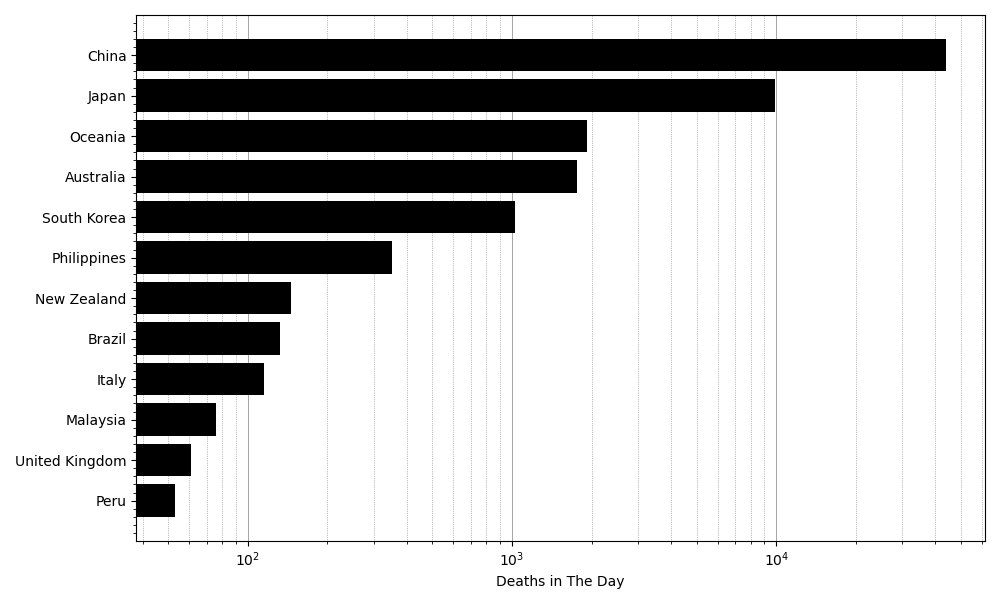

<h1>Breakdown of The Highest Death Count in A Single Day</h1>
<a href="../README.md">Back to home</a>

  <h3>Prerequisites</h3>
  

    If you intend to replicate the case study, you need to <a href="./setupDatabase.md">setup the MySQL database on your computer</a>.
  

  <h3>Background</h3>
  

    COVID-19 has killed many people in the last couple of years.
    One may wonder, how does the highest death count in a single day look like, when broken down into death count by country?
  

  <h3>Problem Statement</h3>
  

    In this case study, we are going to explore and visualize the global COVID-19 death count.
    We are particularly interested in the day when the total number of deaths reached its peak.
    We are going to breakdown the death count by country and show a few countries with the highest numbers.
  

  <h3>Solution Steps</h3>
  

    The followings are necessary to synthesize the data and visualize them:
  

  

    

      <strong>Preprocess the data: remove aggregates</strong>
    

     
    

      The table contains several aggregate values:
      <ul>
        <li>Data entry for continents and regions e.g. 'World', 'Europe', etc.</li>
        <li>Data entry for groups of countries based on their level of income e.g. 'Low income', 'High income', etc.</li>
      </ul>
      Therefore, one needs to remove these data entries to avoid getting the wrong total death count.
      The following query removes these aggregate values:
    

    <pre lang="sql">
SELECT *
FROM `covid`.`casesDeaths`
WHERE `location` NOT IN (
    'World', 'Europe', 'Asia', 'North America', 'South America', 'European Union'
  )
  AND `location` NOT LIKE '%%income%%';</pre>
  

  

    

      <strong>Tally the total number of deaths for each date</strong>
    

     
    

      To obtain the total number of deaths for each date, we can use the aggregate function SUM.
      Typically, SUM is used together with GROUP BY.
      However, we are only interested to compute the total number of deaths by `date`, not grouping the data by `date`.
      Therefore, we use PARTITION BY instead.
      The following query gives the desired data:
    

    <pre lang="sql">
SELECT 
  `location`,
  `newDeaths`,
  SUM(`newDeaths`) OVER (PARTITION BY `date`) AS `totalNewDeaths`
FROM `covid`.`casesDeaths`
WHERE `location` NOT IN (
    'World', 'Europe', 'Asia', 'North America', 'South America', 'European Union'
  )
  AND `location` NOT LIKE '%%income%%';</pre>
  

  

    

      <strong>Retrieve death count for a few countries in the day that total number of deaths is at its peak</strong>
    

     
    

      After adding the total number of deaths, we now filter the data such that only the data entry with the largest total number of deaths remain.
      Subsequently, we order by the number of deaths in the country from highest to lowest and limit the result to 'numCountries' number of countries:
    

    <pre lang="sql">
WITH `countryData` AS (
  SELECT 
    `location`,
    `newDeaths`,
    SUM(`newDeaths`) OVER (PARTITION BY `date`) AS `totalNewDeaths`
  FROM `covid`.`casesDeaths`
  WHERE `location` NOT IN (
    'World', 'Europe', 'Asia', 'North America', 'South America', 'European Union'
    )
    AND `location` NOT LIKE '%%income%%'
)
SELECT `location`, `newDeaths`
FROM `countryData`
WHERE `totalNewDeaths` = (SELECT MAX(`totalNewDeaths`) FROM `countryData`)
ORDER BY `newDeaths` DESC
LIMIT numCountries;</pre>
    

      Note that you cannot execute the SQL query above because 'numCountries' is undefined.
      In the following section, we replace this variable with a value in Python.
    

  

  

    

      <strong>Visualize the results using a horizontal bar chart</strong>
    

     
    

      We use matplotlib.pyplot in Python to create the horizontal bar chart.
      First, store the query result in the dataframe 'df', see <a href="./pythonSQL.md">execute SQL query using Python</a> for detailed instruction to do this.
      After reading the SQL script, we need to replace 'numCountries' with a value:
    

    <pre lang="python">
numCountries = 12
with open('deathsBreakdown.sql', 'r') as file:
  sqlScript = file.read()
sqlScript = sqlScript.replace("numCountries", str(numCountries))</pre>
    

      Subsequently, we can create a horizontal bar chart using matplotlib.pyplot (imported as plt):
    

    <pre lang="python">
fig, ax = plt.subplots(figsize=(10,6))
ax.barh(df['location'], df['newDeaths'], color='black', zorder=2)
ax.set_xlabel('Deaths in The Day')
ax.set_xscale('log')
ax.grid(which='both', linestyle='-', linewidth=0.5, color='gray', axis='x', zorder=1)
ax.minorticks_on()
ax.grid(which='minor', linestyle=':', linewidth=0.5, color='gray', axis='x', zorder=1)
plt.tight_layout()
plt.show()</pre>
  

  <h3>Results</h3>
  

    If you follow all the steps successfuly, you will obtain the following plot:
  

  
   
  

    Looking at the plot, we can see that China has the highest death count, followed by Japan.
    Interestingly, India was not positioned in the top 12, despite having the second largest population (at the time).
  

