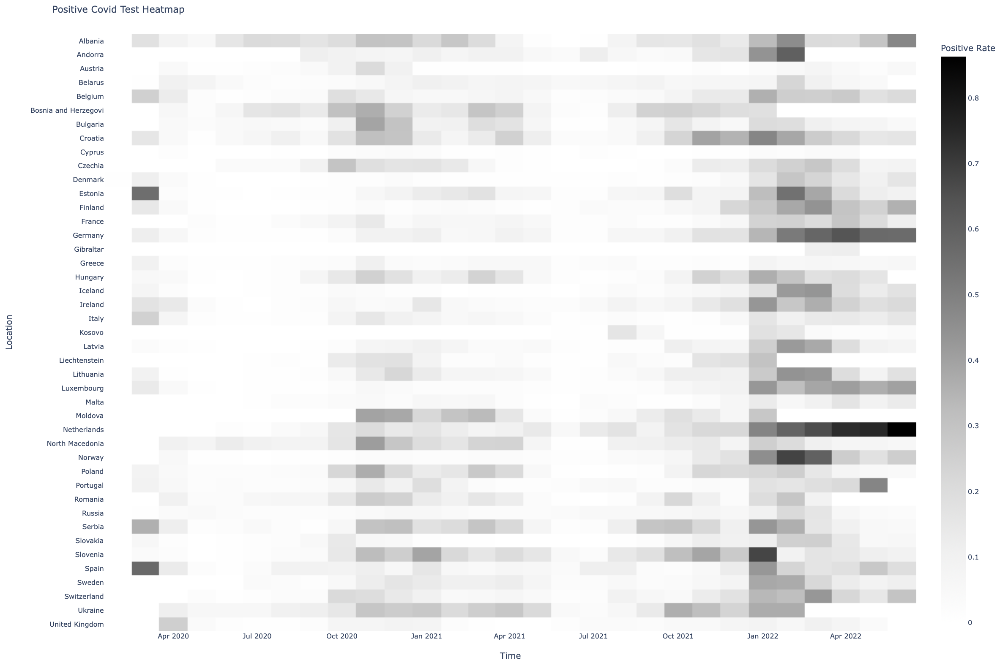

<h1>Positive COVID-19 Test Rate in Europe</h1>
<a href="../README.md">Back to home</a>

  <h3>Prerequisites</h3>
  

    If you intend to replicate the case study, you need to <a href="./setupDatabase.md">setup the MySQL database on your computer</a>.
  

  <h3>Background</h3>
  

    The number of new COVID-19 cases fluctuates over time and varies accross different countries.
    A high number of new cases does not necessarily equal to a high infection rate because, given the same infection rate:
    <ul>
      <li>Countries with larger population are going to have higher numbers of new cases.</li>
      <li>Countries with higher number of tests are going to report higher numbers of new cases.</li>
    </ul>
    An alternative metric to quantify infection rate is the positive test rate.
    It is a ratio between the number of positive test results and the total number of tests.
    While the metric is not perfect, it may provide better insights to the infection rate in each country at a given time.
  

  <h3>Problem Statement</h3>
  

    In this case study, we are going to explore and visualize the positive COVID-19 test rate in Europe.
    The data are available in the following three tables:
    <ul>
      <li>casesDeaths</li>
      <li>countries</li>
      <li>testing</li>
    </ul>
    The table `casesDeaths` contains information about the number of daily new cases in each country.
    The table `countries` lists countries with their respective continent and population.
    The table `testing` contains the number of daily COVID-19 tests in each country.
  

  <h3>Solution Steps</h3>
  

    The followings are necessary to synthesize the data and visualize them:
  

  

    

      <strong>Extract a list of countries that belong to Europe from `countries`</strong>
    

     
    

      The table `casesDeaths` and `testing` store data for each country but they do not have information about the continent i.e., which country belongs to Europe, Asia, etc..
      Therefore, the list of countries in Europe must be extracted from table `countries`.
      The following query gives the desired list:
    

    <pre lang="sql">
SELECT `country`
FROM `covid`.`countries`
WHERE `continent` = 'Europe';</pre>
  

  

    

      <strong>Pair the number of new cases from `casesDeaths` and tests from `testing` for each country and date</strong>
    

     
    

      The information for positive test results i.e. the number of new cases and the information for the number of tests are in two separate tables.
      Therefore, we need to perform a JOIN operation.
      We also need to ensure that the two data are associated to the same location and date.
    

    

      Table `testing` stores the location in `entity` while table `casesDeaths` stores the location in `location`.
      While `casesDeaths`.`location` entry may look like 'Germany', the entry in `testing`.`entity` looks like 'Germany - tests'.
      Therefore, we cannot simply match the two entries and need to use the LIKE funtion in SQL.
      The following query pair the number of new cases with the total number of tests from the two tables:
    

    <pre lang="sql">
SELECT cd.`location`, cd.`newCases`, ct.`smoothedDailyChange`
FROM `covid`.`casesDeaths` AS cd
  JOIN `covid`.`testing` AS ct
    ON ct.`entity` LIKE CONCAT(cd.`location`, '%') AND ct.`date` = cd.`date`;</pre>
  

  

    

      <strong>Compute the monthly ratio between number of cases to tests</strong>
    

     
    

      To obtain monthly data, we need to extract the month from `date` and use the GROUP BY function.
      Since the dataset spans multiple years, we need to include the year information as well.
      This is doable by using the DATE_FORMAT function.
    

    

      The ratio may be NULL because of missing data from any of the two tables.
      To tackle this problem, we replace the NULL value with zeros by using the COALESCE function.
      In other cases, the ratio may exceeds unity due to mismatching time stamps.
      Therefore, we exclude the ratio that exceeds one in the resulting data.
    

    

      The following query gives the monthly ratio:
    

    <pre lang="sql">
SELECT 
  DATE_FORMAT(cd.`date`, '%Y-%m') AS `yearMonth`, 
  cd.`location`, 
  COALESCE(SUM(cd.`newCases`) / NULLIF(SUM(ct.`smoothedDailyChange`), 0), 0) as `positiveRate`
FROM `covid`.`casesDeaths` AS cd
  JOIN `covid`.`testing` AS ct
    ON ct.`entity` LIKE CONCAT(cd.`location`, '%') AND ct.`date` = cd.`date`
GROUP BY yearMonth, location
HAVING `positiveRate` <= 1;</pre>
  

  

    

      <strong>Obtain the monthly ratio for all countries in Europe</strong>
    

     
    

      This step combines the three steps above in a single query:
    

    <pre lang="sql">
WITH `europe` AS (
  SELECT `country`
    FROM `covid`.`countries`
    WHERE `continent` = 'Europe'
)
SELECT 
  DATE_FORMAT(cd.`date`, '%Y-%m') AS `yearMonth`, 
  cd.`location`, 
  COALESCE(SUM(cd.`newCases`) / NULLIF(SUM(ct.`smoothedDailyChange`), 0), 0) as `positiveRate`
FROM `covid`.`casesDeaths` AS cd
  JOIN `covid`.`testing` AS ct
    ON ct.`entity` LIKE CONCAT(cd.`location`, '%') AND ct.`date` = cd.`date`
WHERE cd.`location` IN (SELECT `country` FROM `europe`)
  AND cd.`date` BETWEEN '2019-01-01' AND '2023-12-31'
GROUP BY yearMonth, location
HAVING `positiveRate` <= 1;</pre>
    

      The first step is included in the Common Table Expression (CTE) and is assigned the alias `europe`.
      The second and third steps form the main query.
      This query gives monthly ratio between the number of new cases and the number of tests for all countries in Europe.
      The query is available inside the <a href="../scripts/positiveRate.sql">positiveRate.sql</a> file.
    

  

  

    

      <strong>Visualize the monthly ratio in a heatmap</strong>
    

     
    

      We use plotly.express in Python to create the heatmap.
      First, store the query result in the dataframe 'df', see <a href="./pythonSQL.md">execute SQL query using Python</a> for detailed instruction to do this.
      Then, we pivot the dataframe using `location` as index, `yearMonth` as columns, and `positiveRate` as values.
      Since some values are missing, we replace these missing values with zeros using the function fillna().
      <pre lang="python">
df_pivot = df.pivot(index='location', columns='yearMonth', values='positiveRate')
df_pivot = df_pivot.fillna(0)</pre>
      Subsequently, we create the heatmap, adjusted the layout so that all country names are visible, and show it:
      <pre lang="python">
fig = px.imshow(
  df_pivot,
  x=df_pivot.columns.format(),
  y=df_pivot.index,
  labels=dict(x='Time', y='Location', color='Positive Rate'),
  title='Positive Covid Test Heatmap',
  color_continuous_scale='Greys'
)
fig.update_layout(
  font=dict(size=8),
  margin=dict(l=50, r=50, t=50, b=50),
)

fig.show()</pre>
    

  

  <h3>Results</h3>
  

    If you follow all the steps successfuly, you will obtain the following heatmap:
  

  
   
  

    Looking at the heatmap, we can identify two periods when the positive test rate increase: October 2020 - April 2021 and October 2021 onwards.
    The latter is more obvious and has a definitive peak on January 2022.
    This upswing is likely caused by the combination of a new variant Omicron and mass gatherings during the new year celebration.
  

